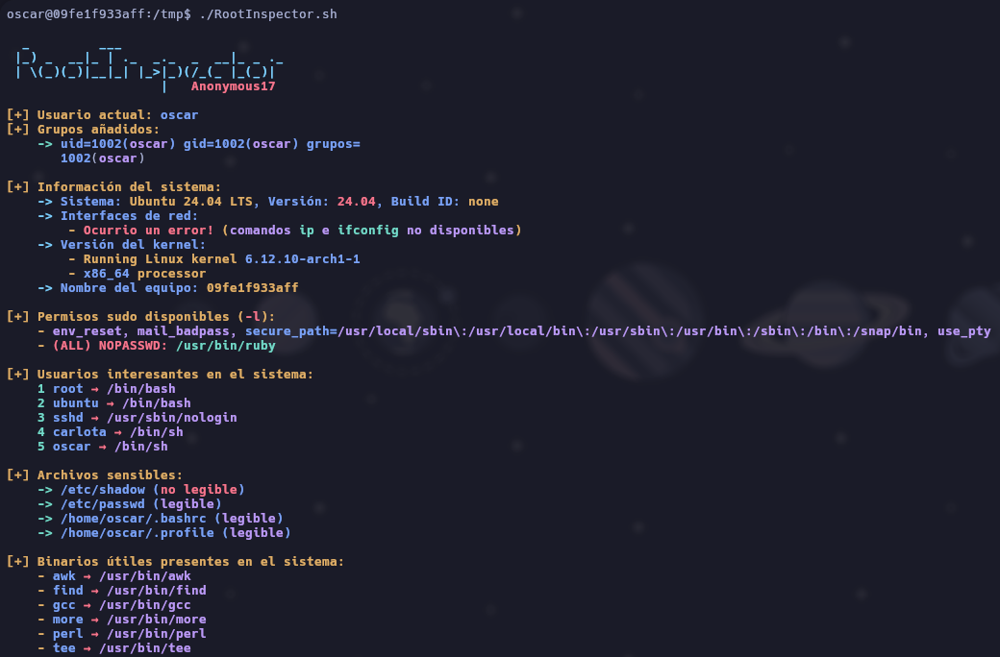
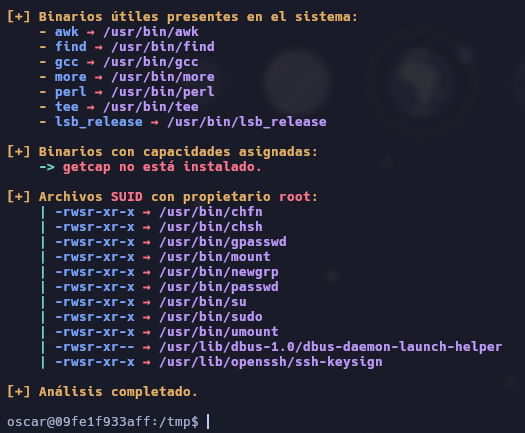
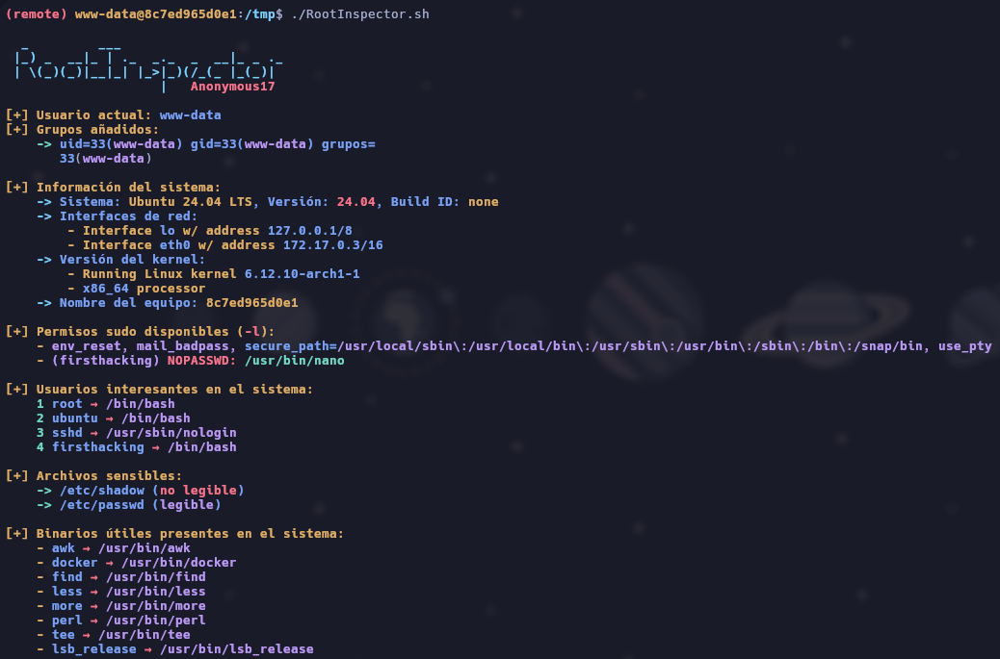
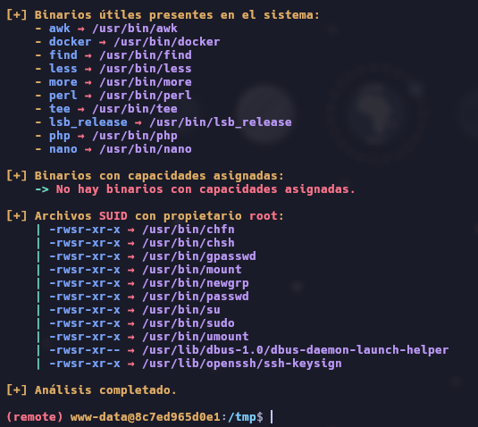
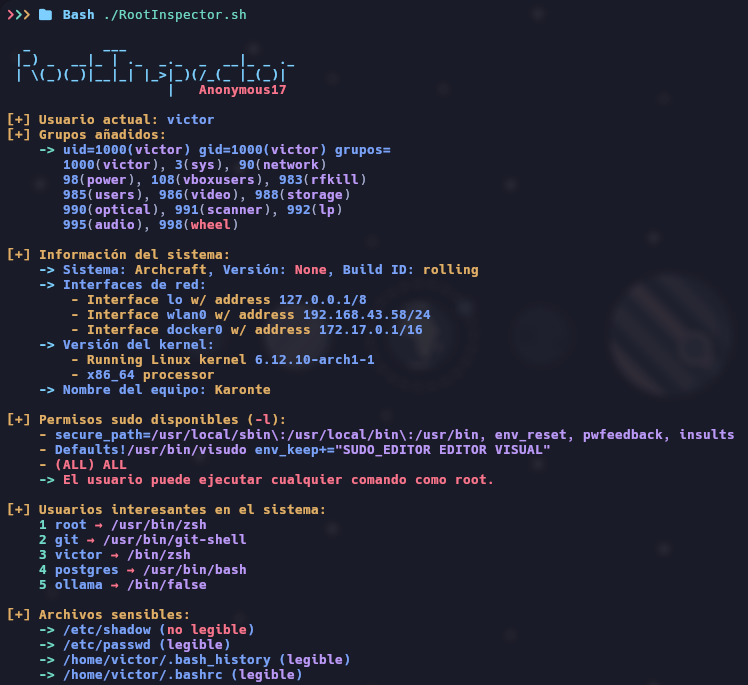
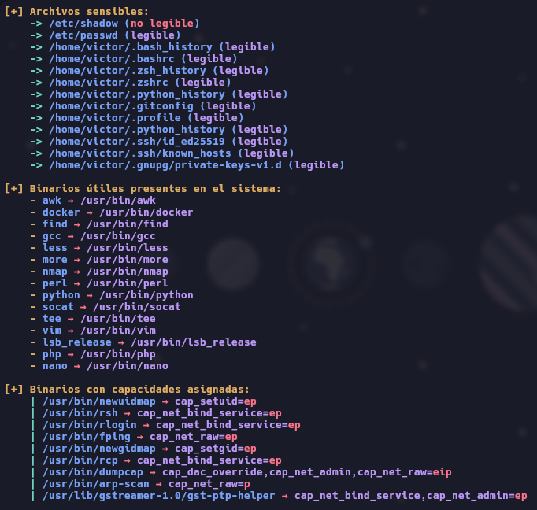
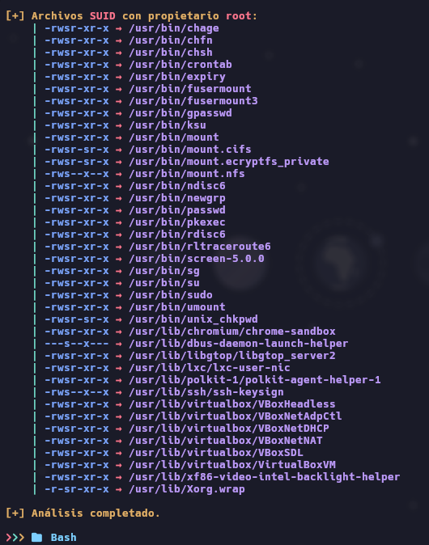

# 🔍 RootInspector.sh

`RootInspector.sh` es una herramienta automatizada desarrollada en Bash cuyo objetivo principal es **auditar y recolectar información crítica de un sistema Linux** que pueda ser útil para tareas de _post-explotación_, _elevación de privilegios_ o simplemente para obtener una visión general del entorno desde una perspectiva de seguridad.

> ⚠️ **Uso ético solamente**: Esta herramienta está diseñada para profesionales de la ciberseguridad, investigadores y entusiastas del hacking ético. No se debe usar en sistemas sin autorización explícita.

---
## 📌 Características principales

- ✅ Detección de **permisos `sudo`** disponibles para el usuario actual
- ✅ Recolección de **información del sistema**: kernel, arquitectura, red, hostname, etc.
- ✅ Búsqueda de **archivos con permisos SUID**
- ✅ Inspección de **capacidades (`capabilities`) asignadas** a binarios
- ✅ Revisión de **archivos sensibles** que pueden contener información útil para un atacante
- ✅ Listado de **usuarios interesantes**
- ✨ Salida coloreada y bien organizada para facilitar la lectura

---
## 🧠 ¿Para qué sirve?

Este script está orientado principalmente al **post-explotación**, es decir, después de haber obtenido acceso a un sistema, ya sea por un exploit o acceso inicial, `RootInspector.sh` te ayuda a determinar:

- Si puedes escalar privilegios mediante `sudo`
- Si hay archivos SUID mal configurados
- Si hay binarios con capacidades que puedes explotar
- Qué archivos sensibles están presentes y si son legibles
- Qué usuarios hay en el sistema que puedan ser objetivo de ataque

---
## 📸 Capturas de pantalla

> ⚙️ Se incluyen 7 imágenes de ejemplo mostrando su ejecución en diferentes laboratorios controlados:









---
## 🚀 Uso

```bash
git clone https://github.com/anonymous-17-03/RootInspector.git
cd RootInspector
chmod +x RootInspector.sh
./RootInspector.sh
```

El script está pensado para ejecutarse **localmente**, sin necesidad de argumentos. Asegúrate de tener permisos de lectura suficientes para aprovechar toda la funcionalidad.

---
## 🛠️ Requisitos

- Bash (ya viene por defecto en la mayoría de distros)
- Herramientas comunes como `ip`, `getcap`, `find`, `awk`, `ls`, etc.
- Permiso para ejecutar `sudo -l` sin requerir contraseña (opcional pero recomendado)

> 💡 Consejo: Algunos resultados dependen de si tienes permisos elevados o si tu usuario puede correr `sudo -l` sin ingresar password.

---

## 🧱 Estructura del script

- **Colores personalizados** para facilitar la lectura
- **Control de interrupciones** (`Ctrl+C`) para limpiar residuos y salir elegantemente
- **Funciones organizadas por secciones**:
    - `check_sudo()`: Busca posibles privilegios mediante `sudo`
    - `SystemInfo()`: Muestra detalles del sistema
    - `check_suid()`: Lista todos los archivos SUID con propietario root
    - `check_capabilities()`: Busca binarios con capacidades especiales asignadas
    - `check_sensitive_files()`: Verifica la existencia y lectura de archivos sensibles
    - `check_users()`: Verifica los usuarios existentes en el sistema
    - `check_user()`: Muestra información sobre el usuario actual

---
## 📂 Archivos sensibles inspeccionados

Algunos de los archivos que `RootInspector` busca:

```bash
/etc/shadow, /etc/passwd, ~/.bash_history, ~/.zshrc, ~/.ssh/id_rsa, ~/.aws/credentials, ~/.gnupg/private-keys-v1.d, ...
```

Esto puede revelar contraseñas, tokens de acceso, configuraciones de GPG, claves SSH, etc.

---
## 👨‍💻 Autor

- ✒️ Desarrollado por **Anonymous17**
- 💬 Contacto: [GitHub](https://github.com/anonymous-17-03)

---
## ⚠️ Disclaimer

Este software se proporciona con fines **educativos y de prueba** en entornos controlados. El autor no se responsabiliza por el uso indebido de esta herramienta. **Utilízala únicamente en sistemas que te pertenezcan o tengas permiso para auditar.**

